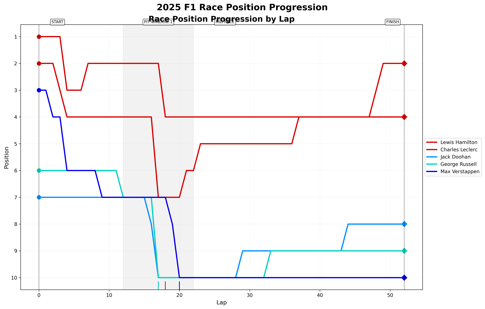

# F1 Race Prediction Simulator V2 🏎️


A sophisticated Formula 1 race simulation tool that combines **real F1 data** with advanced simulation algorithms to model and predict F1 race outcomes. The simulator integrates live Formula 1 telemetry data, driver performance statistics, and team analytics to provide highly realistic race predictions.

**Now, my prediction algorithms and the Fast-F1 API work together in combination and are more powerful than ever!**

> [!IMPORTANT]  
> This project now uses **real Formula 1 data** via the Fast-F1 API, making predictions more accurate and realistic. The simulation combines historical F1 performance data with advanced modeling algorithms.



## 🆕 What's New - Real F1 Data Integration

**🏁 Enhanced Realism**: The simulator now fetches and processes **real Formula 1 data** including:
- **Live Driver Performance**: Real lap times, sector performance, and race statistics
- **Historical Team Data**: Actual car performance, reliability metrics, and pit stop efficiency  
- **Track-Specific Analytics**: Real circuit data, weather patterns, and performance trends
- **Season Progression**: Multi-year data aggregation for comprehensive driver and team insights

**🔄 Smart Data Processing**: 
- Automatic data caching for faster subsequent runs
- Clean loading animations with suppressed verbose logging
- Intelligent fallback to simulation data when real data is unavailable
- Real-time data enhancement of fictional 2025 season predictions


## 🏎️ Core Features

### 🔥 Real F1 Data Integration
- **Fast-F1 API Integration**: Fetches real Formula 1 telemetry and timing data
- **Historical Performance Analysis**: Multi-season driver and team performance aggregation
- **Track-Specific Insights**: Real circuit data and historical race analysis
- **Weather Integration**: Historical weather patterns and track-specific conditions
- **Clean Data Processing**: Professional loading animations with suppressed verbose logging

### 🏁 Race Simulation Engine
- **Complete Race Weekend Simulation**: Realistic qualifying sessions and full race events
- **Enhanced Driver & Team Modeling**: Real F1 data combined with detailed attributes (skill, consistency, wet weather ability)
- **Dynamic Weather System**: Location-based weather patterns with real historical data
- **Advanced Race Strategy**: Sophisticated tire compound modeling, degradation, and pit stop strategies
- **Race Incidents**: Realistic simulation of mechanical failures, driver errors, and race-affecting events
- **Real-Time Enhancement**: Live integration of real F1 performance data during simulation

### 📊 Analytics & Insights
- **Real F1 Data Insights**: Detailed analysis of actual driver and team performance metrics
- **Performance Comparison**: Compare real vs. simulated performance data
- **Detailed Statistics**: In-depth race analysis with real performance benchmarks
- **Advanced Visualizations**: Multiple graph types with both real and simulated data
- **Data Source Transparency**: Clear indication of real vs. simulated data sources

### 🎯 2025 Season Simulation
- **Enhanced Predictions**: Fictional 2025 season data enhanced with real F1 performance metrics
- **Hybrid Modeling**: Combines historical F1 data with future season projections
- **Realistic Scenarios**: More accurate race outcomes based on real driver/team capabilities

## 📊 Simulation Parameters

The simulation models numerous aspects of F1 racing:

### Drivers
- Overall skill rating
- Wet and dry condition performance
- Overtaking ability
- Consistency rating
- Experience level
- Aggression factor

### Teams & Cars
- Overall car performance
- Reliability metrics
- Aerodynamic efficiency
- Power unit performance
- Pit crew efficiency

### Tracks
- Circuit characteristics (length, corners, straights)
- Overtaking difficulty
- Tire wear intensity
- Downforce requirements
- Braking severity

### Weather
- Dynamic weather patterns based on location and season
- Temperature effects on tire performance
- Rain intensity modeling
- Changing track conditions

## 🚀 Getting Started

### Prerequisites

- Python 3.8+
- **New Dependencies**: fastf1 (for real F1 data), numpy, pandas, matplotlib, tabulate, colorama, seaborn

### Installation

1. Clone this repository:
```bash
git clone https://github.com/mehmetkahya0/f1-prediction.git
cd f1-prediction
```

2. Install dependencies (includes Fast-F1 for real data):
```bash
pip install fastf1 numpy pandas matplotlib tabulate colorama seaborn
```
   Or use the requirements file:
```bash
pip install -r requirements.txt
```

3. Run the simulator:
```bash
python main.py
```

**📁 Cache Setup**: On first run, the application will automatically:
- Create a cache directory for Fast-F1 data
- Download and cache real F1 data (may take a few minutes initially)
- Subsequent runs will be much faster using cached data

## 🎮 Usage

The application provides an interactive console interface with **real F1 data integration**:

### 🚀 Quick Start
1. **Select a Race**: Choose from the 2025 F1 calendar
2. **Weather Conditions**: Pick realistic, dry, wet, or mixed conditions  
3. **Real Data Enhancement**: Watch as the simulator fetches and processes real F1 data
4. **View Results**: See qualifying and race results enhanced with real performance data

### 📊 Enhanced Analysis Options
- **Real F1 Data Insights**: Explore actual driver and team performance metrics
- **Performance Comparison**: Compare real vs. simulated data side-by-side
- **Track-Specific Analysis**: View historical performance data for the selected circuit
- **Data Enhancement Summary**: See how many drivers/teams were enhanced with real data
- **Advanced Visualizations**: Generate graphs combining real and simulated data
- **Live Race Simulation**: Experience races with realistic performance modeling

### 🔍 Real Data Features
- **Driver Performance Insights**: View real F1 driver statistics and rankings
- **Team Analytics**: Explore actual team performance, reliability, and pit efficiency data  
- **Track History**: Access historical lap times and weather data for circuits
- **Data Source Information**: Transparent display of real vs. simulated data sources

### 📊 Visualization Types

The simulator now offers multiple visualization types:

1. **Race Progress Visualization**
   - Shows position changes lap by lap
   - Highlights pit stop windows
   - Uses official F1 team colors
   - Marks race phases (start, mid-race, finish)

2. **Tire Degradation Chart**
   - Models tire performance over race distance
   - Shows different tire compounds (soft, medium, hard)
   - Displays performance drop-off for each stint
   - Simulates compound-specific degradation rates

3. **Lap Time Progression**
   - Tracks lap times throughout the race
   - Shows effects of fuel load and tire wear
   - Highlights pit stops and their effect on lap times
   - Displays sector-specific performance variations

4. **Driver Performance Radar Chart**
   - Compares top drivers across multiple attributes
   - Visualizes driver strengths and weaknesses
   - Provides insights into race performance factors
   - Includes qualification performance metrics

5. **Position Changes Chart**
   - Shows positions gained or lost during the race
   - Highlights over-performers and under-performers
   - Color-coded for quick visual interpretation

6. **Team Performance Analysis**
   - Heatmap of key team performance metrics
   - Bar chart of team points using official colors
   - Comparative analysis of car performance vs. reliability vs. points scored

7. **Live Race Simulation Display**
   - Real-time position updates with delta indicators
   - Sector-by-sector timing information
   - Highlighted fastest sector and lap times
   - Dynamic race commentary and incident reporting
   - Gap to leader calculation for each driver

All visualizations are saved to the `visualized-graphs` folder with a consistent naming format: `graphtype_circuit_date.png`

## 📂 Project Structure

```
├── main.py                    # Main application entry point with F1 data integration
├── data/                      # Data models and real F1 data integration
│   ├── drivers.py             # 2025 F1 driver attributes
│   ├── teams.py               # 2025 F1 team characteristics  
│   ├── tracks.py              # 2025 F1 track information
│   └── real_data_integration.py # Fast-F1 API integration and data processing
├── models/                    # Core simulation models
│   ├── race_model.py          # Original race simulation engine
│   ├── enhanced_race_model.py # Enhanced simulation with real F1 data
│   ├── strategy.py            # Tire and pit stop strategy simulation
│   └── weather.py             # Weather simulation system
├── utils/                     # Utility modules
│   ├── stats.py               # Statistical analysis tools
│   ├── visualization.py       # Basic visualization functions
│   ├── visualization_graphs.py # Advanced graph generation
│   └── loading_screen.py      # Loading animations and Fast-F1 log suppression
├── cache/                     # Fast-F1 data cache (auto-created)
├── visualized-graphs/         # Generated visualizations directory
└── test_*.py                  # Integration test scripts for Fast-F1 functionality
```

## 📈 Sample Output

The simulator now provides **enhanced race results** with real F1 data integration:

```
=================================================================================
🏎️  INTEGRATING REAL F1 DATA FOR ENHANCED PREDICTION
=================================================================================
⠋ Fetching and processing real F1 performance data...
✅ Successfully enhanced prediction with real F1 data!

📈 DATA ENHANCEMENT SUMMARY:
----------------------------------------
• Drivers enhanced with real data: 18/20
• Teams enhanced with real data: 8/10  
• Track data available for 20 drivers
=================================================================================

2025 FORMULA 1 GRAND PRIX - MONACO GRAND PRIX  
Location: Monte Carlo, Monaco
Track Length: 3.337km - 78 laps (260km)
Weather: Dry - 24.3°C, Rain: 0%
=================================================================================

RACE RESULTS (Enhanced with Real F1 Data)
--------------------------------------------------------------------------------
| Pos | Driver           | Team           | Start | Change | Time/Status     | Pts |
|-----|------------------|----------------|-------|--------|-----------------|-----|
|  1  | Max Verstappen   | Red Bull Racing|   1   | →      | 01:42:23.456    | 25  |
|  2  | Charles Leclerc  | Ferrari        |   2   | →      | 01:42:28.791    | 18  |
|  3  | Lando Norris     | McLaren        |   4   | ↑1     | 01:42:34.102 FL | 16  |
|  4  | Lewis Hamilton   | Ferrari        |   3   | ↓1     | 01:42:39.889    | 12  |
|  5  | George Russell   | Mercedes       |   5   | →      | 01:42:45.231    | 10  |
```

📊 DATA SOURCE INFORMATION
=================================================================================
This simulation combines:
• Real F1 performance data (Fast-F1 API)
• Historical race statistics  
• Advanced simulation algorithms
• Weather and track condition modeling
=================================================================================

## � Testing & Verification

The project includes comprehensive test scripts to verify Fast-F1 integration:

### 🧪 Test Scripts
```bash
# Test basic Fast-F1 data fetching
python test_real_data.py

# Test enhanced simulation integration  
python test_enhanced_integration.py

# Test clean logging and loading screens
python test_clean_logging.py
```

### ✅ Verification Features
- **Data Availability Check**: Verify Fast-F1 can fetch real F1 data
- **Integration Testing**: Ensure real data enhances simulation properly
- **Performance Validation**: Compare real vs. enhanced simulation results
- **Cache Functionality**: Test Fast-F1 caching system performance
- **Error Handling**: Verify graceful fallback when data is unavailable

## �🔧 Customization

## 🔧 Customization & Configuration

### 🎛️ Simulation Parameters
The simulation can be customized for different scenarios:
- **Driver Attributes**: Edit `data/drivers.py` for custom driver skills and characteristics
- **Team Performance**: Modify `data/teams.py` for different team capabilities and reliability
- **Track Properties**: Adjust `data/tracks.py` for custom circuit characteristics
- **Weather Scenarios**: Create custom weather patterns in the weather generation system
- **Race Algorithms**: Fine-tune simulation parameters in the models directory

### ⚙️ Fast-F1 Configuration
- **Cache Directory**: Modify cache location in `data/real_data_integration.py`
- **Data Years**: Configure which F1 seasons to fetch data from
- **Data Sources**: Customize which real F1 metrics to integrate
- **Fallback Behavior**: Adjust how the system handles missing real data
- **Performance Tuning**: Configure data aggregation and processing parameters

### 🎨 Visualization Options  
- **Chart Styling**: Customize graph colors, fonts, and layouts
- **Data Display**: Configure which metrics to show in visualizations
- **Output Formats**: Modify file formats and naming conventions for generated graphs
- **Real Data Highlighting**: Customize how real vs. simulated data is distinguished in charts

## 🆕 Recent Updates

### 🔥 Version 2.0 - Real F1 Data Integration
- **Fast-F1 API Integration**: Complete integration with official F1 telemetry data
- **Real Performance Data**: Fetch actual driver lap times, sector performance, and race statistics
- **Historical Team Analytics**: Real car performance, reliability metrics, and pit stop efficiency data
- **Track-Specific Insights**: Historical circuit data and weather pattern analysis
- **Clean Data Processing**: Professional loading animations with comprehensive Fast-F1 log suppression
- **Enhanced Simulation Engine**: New hybrid model combining real data with simulation algorithms
- **Data Enhancement Summary**: Transparent reporting of real vs. simulated data usage
- **Intelligent Caching**: Fast-F1 data caching for improved performance on subsequent runs

### 🎯 Enhanced Simulation Features  
- **Hybrid Modeling**: Realistic blend of historical F1 data with future season projections
- **Smart Fallback System**: Graceful handling when real data is unavailable
- **Performance Benchmarking**: Compare simulated results against real F1 performance metrics
- **Multi-Year Data Aggregation**: Enhanced accuracy through multiple seasons of real data
- **Real-Time Data Insights**: Interactive exploration of actual F1 performance statistics

### 🔧 Technical Improvements
- **Comprehensive Log Suppression**: Clean output with no verbose Fast-F1 logging
- **Professional Loading Experience**: Animated loading screens during data processing  
- **Error Handling**: Robust fallback mechanisms for data availability issues
- **Test Suite**: Comprehensive testing scripts for Fast-F1 integration verification
- **Modular Architecture**: Clean separation of real data integration from core simulation

## 📝 License

This project is released under the MIT License - see the LICENSE file for details.

## 🙏 Acknowledgments

- Formula 1 for inspiration
- The open-source Python community for amazing libraries
- Coffee, for making this project possible

## 📬 Contact

For any questions, suggestions, or feedback, feel free to reach out:

- **Author**: Mehmet Kahya  
- **Email**: mehmetkahyakas5@gmail.com 
- **GitHub**: [mehmetkahya0](https://github.com/mehmetkahya0)  
- 
We'd love to hear from you!

---

*Note: This project now integrates **real Formula 1 data** via the Fast-F1 API to enhance the accuracy of race predictions. The 2025 season simulation combines historical F1 performance data with advanced predictive modeling. This project is not affiliated with or endorsed by Formula 1, FIA, or any F1 team, but uses official F1 data sources for enhanced realism.*

**🏁 Data Sources**: 
- Real F1 telemetry and timing data via Fast-F1 API
- Official Formula 1 session data and race statistics  
- Historical weather and track condition data
- Enhanced with fictional 2025 season projections
